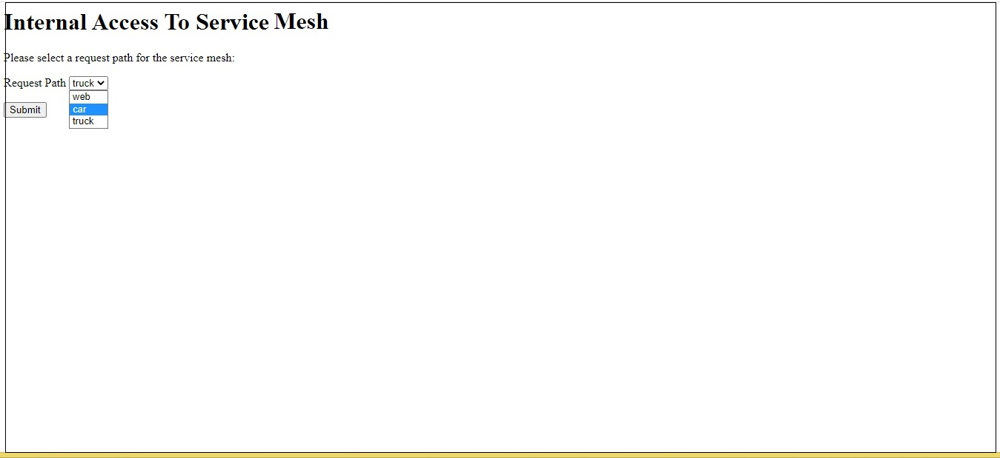

## Intra-K8s access to Istio Service Mesh
Let's illustrate a handy trick of accessing an Istio service mesh from within a K8s cluster, say one of the pods deployed inside the cluster, instead of via an istio ingress gateway.

For a quickstart with this example, first go to https://istio.io/latest/docs/setup/getting-started/ and deploy Istio if you haven't done so. Assume the default name space is labelled for Istio Envoy sidecar injection.

Deploy the K8s backend and frontend workloads, services that make up the service mesh.
```
kubectl apply -f https://raw.githubusercontent.com/snpsuen/Intra-K8s_Access_Istio_Service_Mesh/main/manifests/webapp-deployment-v4041.yaml
kubectl apply -f https://raw.githubusercontent.com/snpsuen/Intra-K8s_Access_Istio_Service_Mesh/main/manifests/webapp-service.yaml
kubectl apply -f https://raw.githubusercontent.com/snpsuen/Intra-K8s_Access_Istio_Service_Mesh/main/manifests/car-truck-catalog-deployment.yaml
kubectl apply -f https://raw.githubusercontent.com/snpsuen/Intra-K8s_Access_Istio_Service_Mesh/main/manifests/meshfront-deployment.yaml
kubectl apply -f https://raw.githubusercontent.com/snpsuen/Intra-K8s_Access_Istio_Service_Mesh/main/manifests/meshfront-service.yaml
kubectl get svc
```
Now the crux of the exercise is to set up a podless K8s service as an internal entry point to the service mesh.
~~~
kubectl apply -f https://raw.githubusercontent.com/snpsuen/Intra-K8s_Access_Istio_Service_Mesh/main/manifests/service-mesh.yaml
~~~

Deploy the desirable Istio destination rule and virtual service.
~~~
kubectl apply -f https://raw.githubusercontent.com/snpsuen/Intra-K8s_Access_Istio_Service_Mesh/main/manifests/destination-rule-v4041.yaml
kubectl apply -f https://raw.githubusercontent.com/snpsuen/Intra-K8s_Access_Istio_Service_Mesh/main/manifests/service-mesh-vs.yaml
~~~

Land in the home page (index.html) on meshfront-service via the given load balancing VIP or node port of one of the K8s hosts, and select a backend service to access.



Alternatively, use curl on a K8s host to post requests repetively to meshfront-service via the given node port.
~~~
while true
do
  curl -X POST -F 'path=web' http://localhost:<NodePort>/accessmesh
  echo ""
  curl -X POST -F 'path=car' http://localhost:<NodePort>/accessmesh | grep car
  curl -X POST -F 'path=truck' http://localhost:<NodePort>/accessmesh | grep truck
  sleep 3
done
~~~


